# Tennis Score Tracker
Tennis Score Tracker is an Android Application that allows for officiating/scorekeeping during tennis matches with family and friends.
Users can customize the format of each match (either singles or doubles) and the number of sets to play. 
Players can also create their own profiles and see their win-loss records, which are stored locally in a SQLite Database. 

Ideal for tablet devices. 

Written in Java. Requires Android Version 4.0.3 (API Level 15) or above. Target is Android Version 10 (API Level 29).

## Features
- Scoreboard - displays the score for each set and the current game
- Action Buttons - updates score and allows statistics such as aces, winners, and errors to be tracked for each player
- Customizable Matches - allows users to choose between singles or doubles and 1, 3, or 5 sets
- Player Records Database - tracks and displays the win-loss records of each player 
- Future features I'm considering: Previous Match Results Database, Stats Display for Players, Detailed Match Summary 

## What I've Learned - A Reflection
This was a very fruitful personal project and I gained a great deal of experience in Android Development. In particular, I learned about:
- Android's Activity lifecycle
- Fragments - their lifecycle and how to incorporate them into modular design
- UI Layout design using XML 
- Writing SQL queries and implementing CRUD (Create, Read, Update, Delete) functionality for an SQLite Database. 

## Gallery
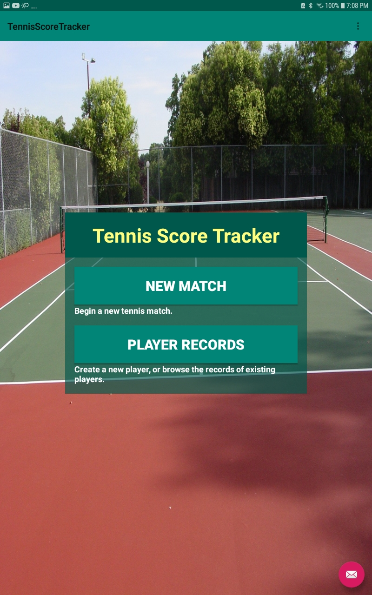 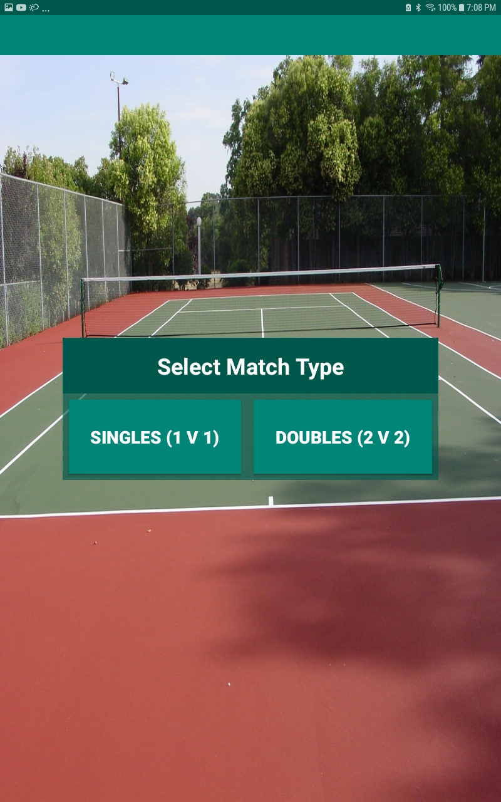 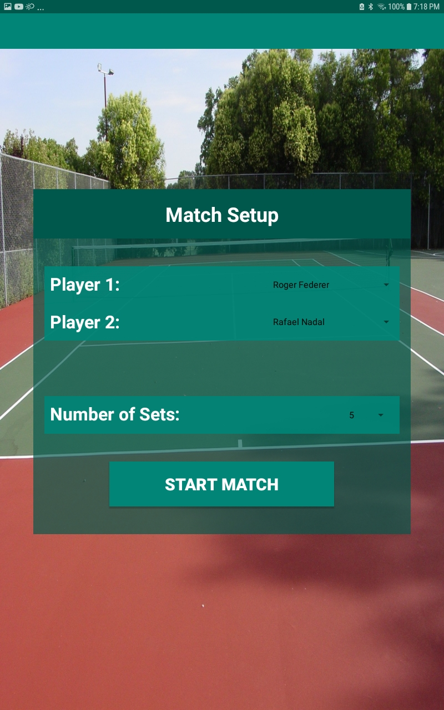  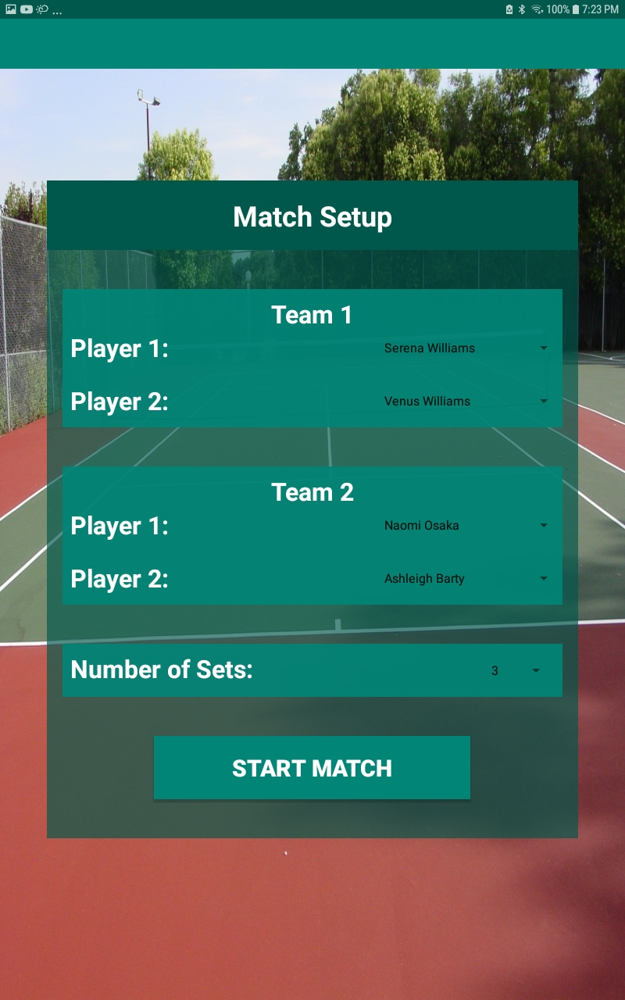 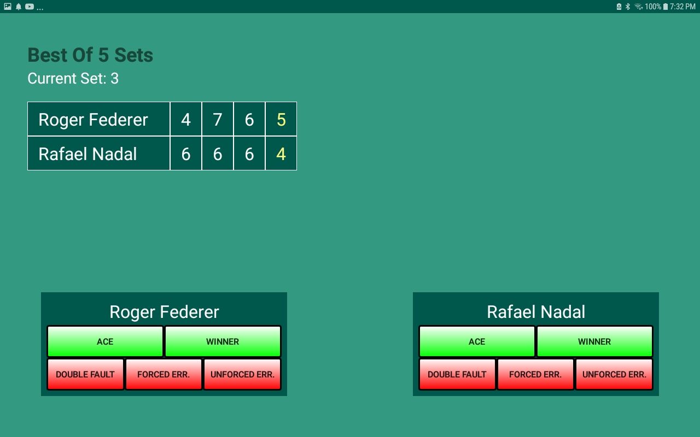 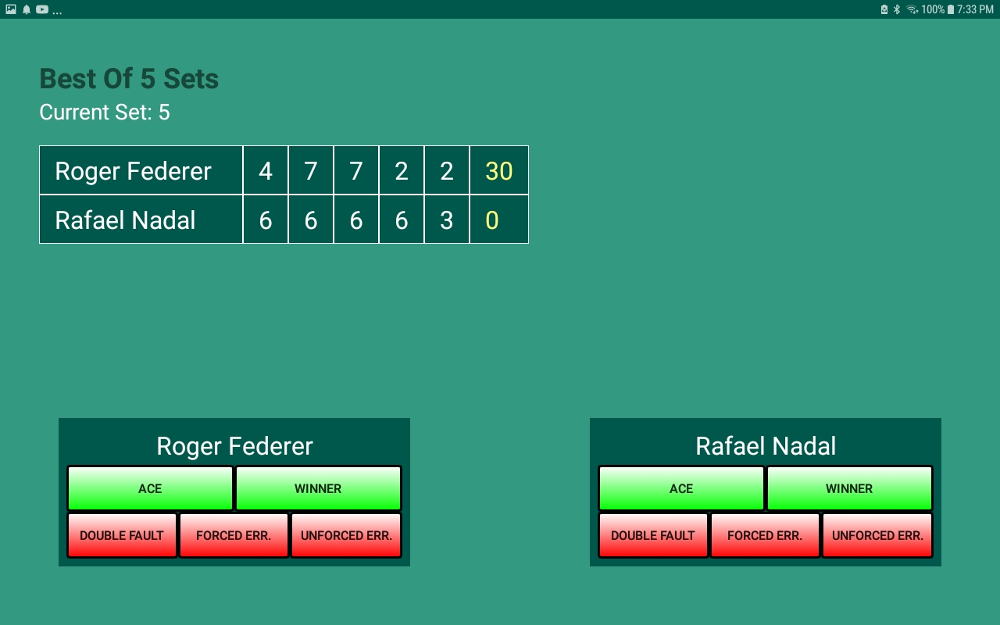 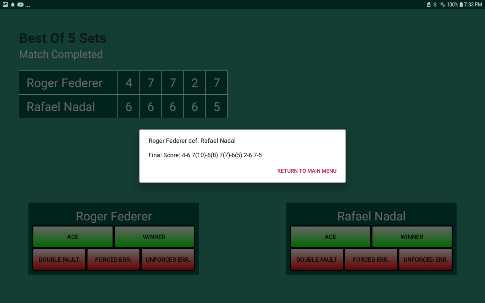 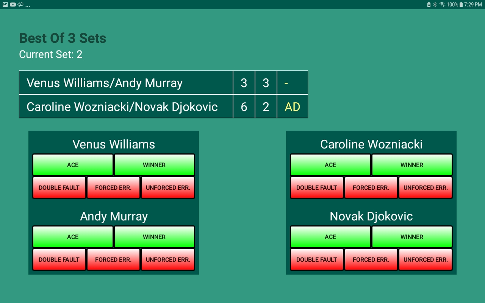 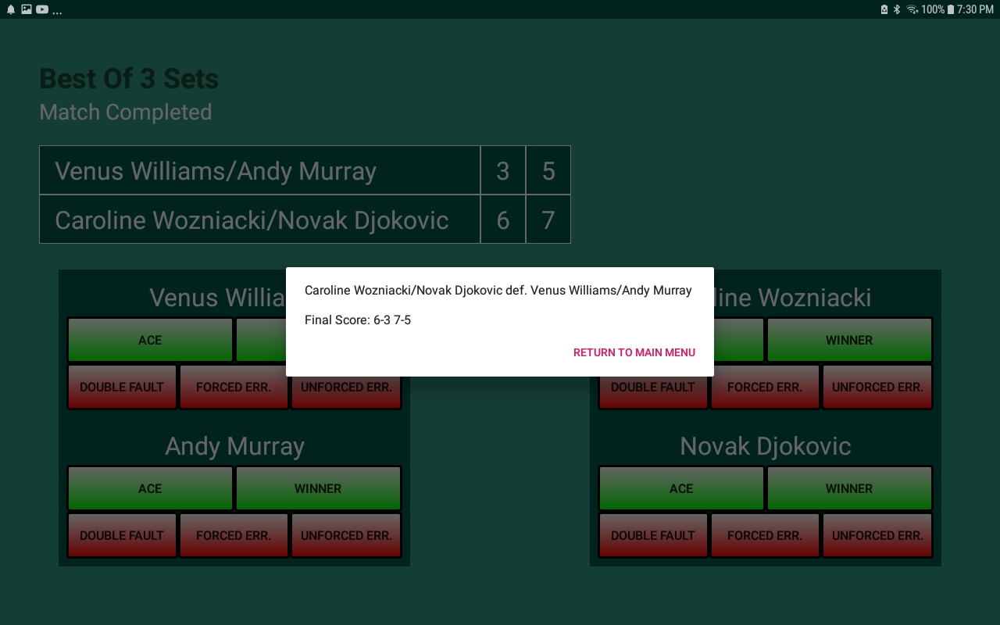 
 
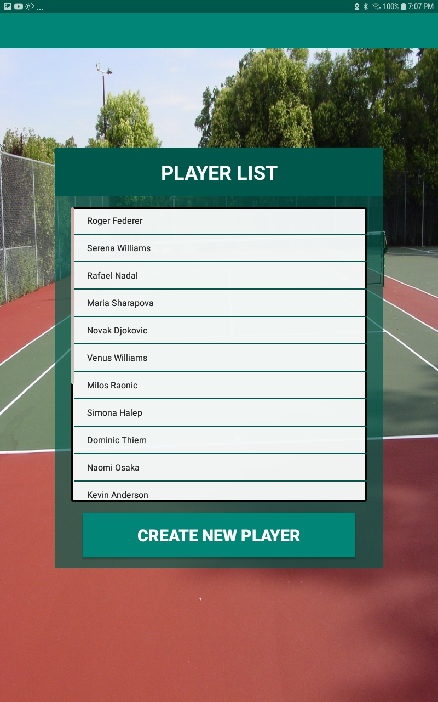 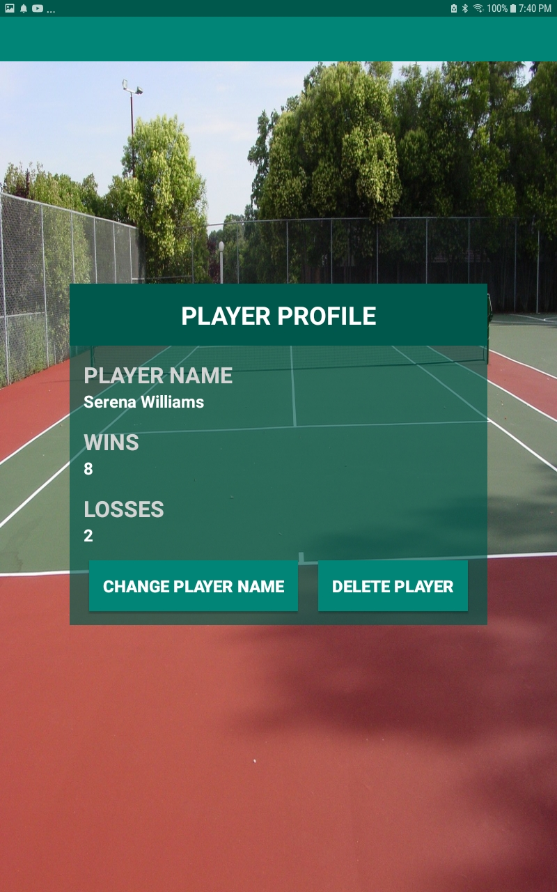 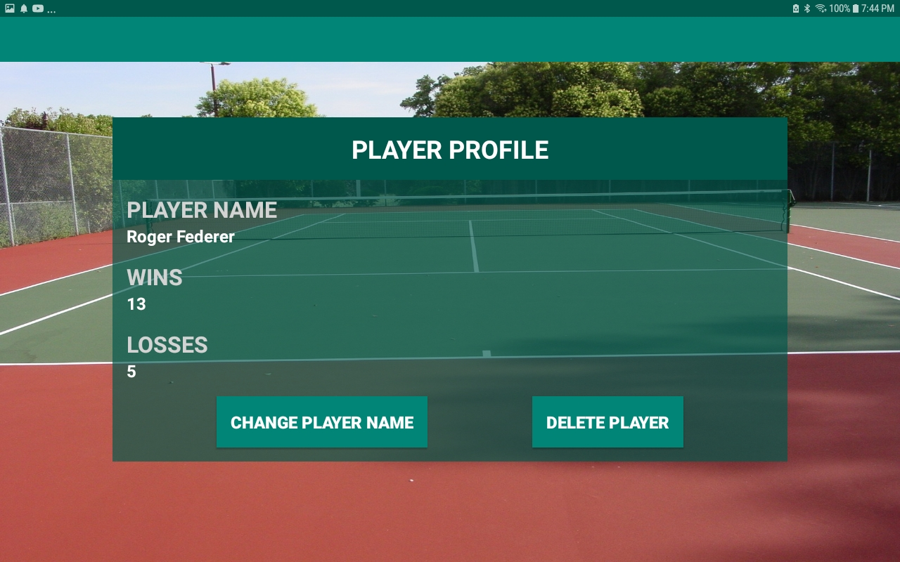

Background image used under a Creative Commons Zero (CC0) license.
